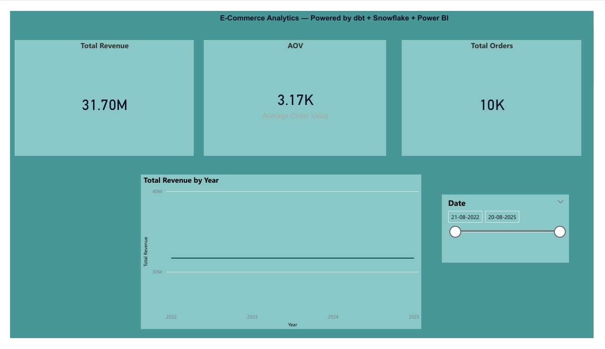

# E-Commerce Analytics with dbt + Snowflake + Power BI

## 📌 Project Overview

This project demonstrates how to build a modern data pipeline for an **E-Commerce business** using **dbt, Snowflake, and Power BI**.  
The pipeline transforms raw CSV data into clean, analytics-ready tables and delivers insights such as **customer behavior, sales performance, and revenue analysis**.

---

## ⚙️ Tech Stack

- **Snowflake** – Cloud data warehouse to store raw and transformed data
- **dbt (Data Build Tool)** – Data transformations, testing, and modeling
- **Power BI** – Visualization & reporting layer
- **GitHub** – Version control & portfolio showcase

---

## 🏗️ Project Structure

```yaml

e_commerce_analytics/
│── models/
│ ├── staging/ # Staging models (raw to cleaned data)
│ │ ├── stg_customers.sql
│ │ ├── stg_orders.sql
│ │ ├── stg_products.sql
│ │ ├── stg_payments.sql
│ │ └── src_raw.yml
│ │
│ ├── marts/ # Dimensional & fact models
│ │ ├── dim_customer.sql
│ │ ├── fact_orders.sql
│ │ ├── fact_payments.sql
│ │ └── dim_products.sql
│ │
│ ├── reporting/ # Reporting layer (final business queries)
│ │ ├── sales_by_region.sql
│ │ ├── revenue_by_category.sql
│ │ └── top_customers.sql
│ │
│ ├── ephemeral/ # Ephemeral models (not persisted in DB)
│ │ └── customer_ranking.sql
│ │
│── tests/
│ └── assert_valid_quanitity.sql
│
│── snapshots/
│ └── customer_snapshot.sql
│
│── dbt_project.yml # dbt configuration
│── README.md # Project documentation
````


---

## 🔑 Features Implemented
- **Staging Models** – Cleaned and standardized data from raw sources
- **Fact & Dimension Models** – Star schema for analytics
- **Ephemeral Model** – In-memory transformation (`customer_ranking`)
- **Snapshot** – Tracks slowly changing customer attributes
- **Hooks** – Example of pre- and post-hooks for audit logging and role grants
- **Tests** – Data quality checks using `unique`, `not null`, and relationships
- **Tags & Selectors** – Organized runs (see below)
- **Power BI Dashboard** – for business reporting  
---

## 🏷️ Tags & Selectors
We applied **tags** to organize models by layers:

```yaml
models:
  e_commerce_analytics:
    staging:
      +tags: ['staging']
    marts:
      +tags: ['marts']
    reporting:
      +tags: ['reporting']
````
⚙️ Sources

Defined in src_raw.yml:
version: 2
```yml
sources:
  - name: raw
    database: E_COMMERCE_DB
    schema: RAW
    tables:
      - name: customers
      - name: orders
      - name: products
      - name: payments
````
## 🏗️ Models


#Staging Models
  example: stg_customers.sql
```yml
select
    customer_id,
    first_name,
    last_name,
    region,
    join_date
from {{ source('raw', 'customers') }}
````

#Dimensional & Fact Models

Example: dim_customer.sql

```yml
{{ config(
    materialized='table'
) }}

select
    customer_id,
    first_name,
    last_name,
    region,
    join_date
from {{ ref('stg_customers') }}
````
#Ephemeral Model

customer_ranking.sql
```yml
{{ config(materialized='ephemeral') }}

select f.customer_id,
       c.first_name || ' ' || c.last_name as customer_name,
       sum(f.amount) as total_spent,
       row_number() over (order by total_spent desc) as ranking
from {{ ref('fact_payments') }} f
join {{ ref('dim_customer') }} c
  on f.customer_id = c.customer_id
group by 1,2
```

##🕒 Snapshots

Example: customer_snapshot.sql
```yml

{{
    config(
        target_schema='snapshots',
        unique_key='customer_id',
        strategy='check',
        check_cols=['first_name', 'last_name', 'region']
    )
}}
select
    customer_id,
    first_name,
    last_name,
    region,
    join_date
from {{ ref('stg_customers') }}

````

##🔧 Hooks

Post-hook example (in dbt_project.yml):
```yml
models:
  e_commerce_analytics:
    reporting:
      +post-hook: "GRANT SELECT ON {{ this }} TO ROLE ANALYST_ROLE"
````

##✅ Tests

Generic test in src_raw.yml:
```yml
models:
  - name: dim_customer
    description: "Customer dimension table"
    columns:
      - name: customer_id
        tests:
          - unique
          - not_null
````

##📊 Reporting

I connected the transformed data in Snowflake to Power BI and created an interactive dashboard.

### Dashboard Pages
1. **Overview**  
   - Total Revenue, Total Orders, Average Order Value  
   - Revenue trend over time  
   - Date filter slicer  

2. **Customer Insights**  
   - Top 10 customers by spend  
   - Revenue by region  
   - Customer detail table with orders and revenue  

3. **Product Performance**  
   - Revenue by product category  
   - Orders trend by category  
   - Category filter slicer  

### Files
- Power BI file:  `E_Commerse_Report`
👉 [Click here to view the full PDF](screenshots/E_Commerse_Report.pdf)

### Example Screenshot

